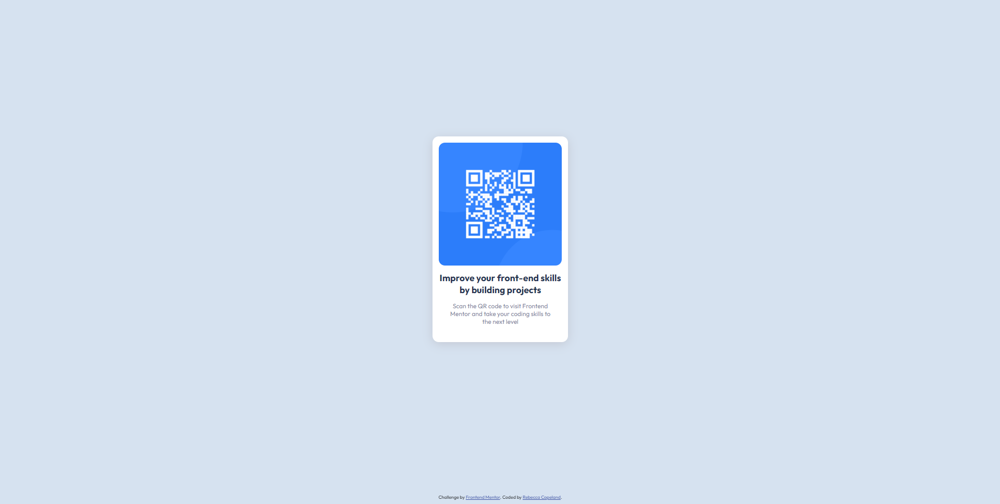

# Frontend Mentor - QR code component solution

This is a solution to the [QR code component challenge on Frontend Mentor](https://www.frontendmentor.io/challenges/qr-code-component-iux_sIO_H). Frontend Mentor challenges help you improve your coding skills by building realistic projects.

## Table of contents

- [Overview](#overview)
  - [Screenshot](#screenshot)
  - [Links](#links)
- [My process](#my-process)
  - [Built with](#built-with)
  - [What I learned](#what-i-learned)
  - [Continued development](#continued-development)
  - [Useful resources](#useful-resources)
- [Author](#author)git a

## Overview

### Screenshot

Desktop Solution Screenshot:

Mobile Solution Screenshot:

### Links

- Solution URL: [Github Repo](https://github.com/rebcop/FM-QRCodeComponent)
- Live Site URL: [Github Pages](https://rebcop.github.io/FM-QRCodeComponent/)

## My process

### Built with

- Semantic HTML5 markup
- CSS custom properties
- Flexbox
- Mobile-first workflow

### What I learned

1. Just because something looks like it's supposed to be centered, a bit offset may be visually more pleasing if there are other components in play. In this case there is the footer in addition to the card.

2. I don't know the difference between "align-content" and "align-items".

3. If you don't have your basics straight, even simple things can through you for a loop.

### Continued development

- play around with "align-content" and "align-items" to got a concrete understanding without referrencing CSS-Tricks.

### Useful resources

- [CSS-Tricks A Complete Guide to Flexbox](https://css-tricks.com/snippets/css/a-guide-to-flexbox/) - This is a resource I always refer to for flex. It's very easy to follow and quick to find what I need.

- [W3 Schools](https://www.w3schools.com/html/default.asp)

- [MDN Web Docs](https://developer.mozilla.org/en-US/docs/Learn)

## Author

- Website - [Rebecca Copeland](https://rebcop.github.io/)
- Frontend Mentor - [@rebcop](https://www.frontendmentor.io/profile/rebcop)
